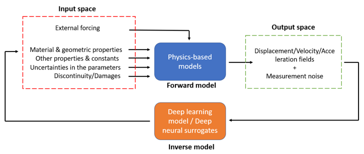

# Deep Inverse Neural Surrogates (DINS)
* DINS is an AI-accelerated approach of solving inverse problem. It utilizes forward simulations in online/offline mode to create surrogate for the inverse problems. Contrary to existing global/local/heurisitcs based optimization approaches, DINS are fast, robust and accurate.
* We have proposed DINS to solve the inverse problem of damage identification or structural health monitoring using guided waves.
* A parallel implementation of a reduced-order spectral finite element model is utilized to formulate the forward problem in an isotropic and a composite waveguide. Along with a time-series dataset, a 2D representation of continuous wavelet transformation based time–frequency dataset is also developed. The datasets are corrupted with several levels of Gaussian random noise to incorporate different levels of noise present in the real scenario.
* Deep learning networks like convolutional and recurrent neural networks are utilized to numerically approximate the solution of the inverse problem. A hybrid strategy of classification and regression in a supervised setting is proposed for combined damage detection and localization.
* The performance of the networks is compared based on metrics like accuracy, loss value, mean absolute error, mean absolute percentage error, and coefficient of determination. The predictions from conventional machine learning algorithms, trained on feature engineered dataset are compared with the deep learning algorithms. The generalization of the trained deep networks on different excitation frequencies and a higher level of uncertainties is also highlighted in this work.

  

-------
#### This repository contains codes accompanying the [paper](https://doi.org/10.1016/j.eswa.2020.114189) "Ultrasonic guided wave based structural damage detection and localization using model assisted convolutional and recurrent neural networks". The dataset accompying the paper is available at Zenodo .
Please cite the paper if you are using the code, datasets or paper for your research paper. 

Basic Details:
* The code is made on Python programming language on Jupyter notebook using Tensorflow 2.0.0. Each line of code is provided with the heading and neccessary descriptions.
* To access the code on google colab, you need to put the dataset in the google drive.
* For more information, you can write to me at my email id: mahindrautela@gmail.com.

Main Details:
* There are 4 folders in the main directory.
* Folders are for classification based 1DCNN and 2DCNN models, regression based 1DCNN, 2DCNN and LSTM models, machine learning models like SVM, Random Forest, ANN
* Folder with 'SDEbase' contains matlab files for Reduced order Spectral Damage Element. This code is very basic and may not fetch accurate results but will provide the basic understanding of SFEM.
